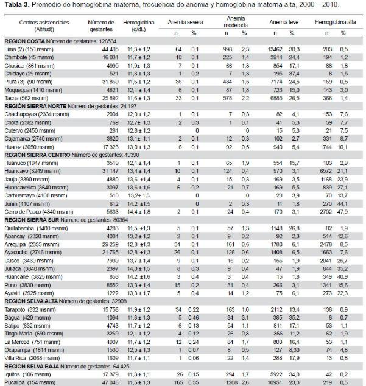

# Conferencia con Nutricionista Bladimir Morales

Se realizó una investigación sobre los temas más importantes que el conferencista, Bladimir Morales,  ha manifestado. Al inicio se abordará el metabolismo del hierro en el cuerpo y posteriormente los presupuestos de la anemia en Perú, el cual a finales de 2017 fue de 40 millones y fue  aprobada por la Junta Ejecutiva del Programa Mundial de Alimentación (PMA).

<h1> Metabolismo del Hierro </h1>

La absorción del hierro en los alimentos se ve afectada por diversos factores, los taninos, fosfatos y fitatos disminuyen la absorción del mismo, mientras que el ácido ascórbico la aumenta. Además, las personas con carencia de hierro o con mayores demandas de este presentan mayor eficiencia en su absorción. Otro aspecto que influye es la biodisponibilidad del hierro en los alimentos que varía mucho, el hierro hemínico que se encuentra en alimentos de origen animal se absorbe en mucha mayor proporción, en comparación con el hierro no hemínico presente en alimentos de origen vegetal como leguminosas, cereales, hortalizas, raíces y frutas. Asimismo, la presencia de hierro hemínico aumentará la absorción de todo el hierro presente en el alimento, incluyendo el no hemínico. Su exceso puede ser dañino para la salud. Por ello el contenido de hierro en el cuerpo tiene un mecanismo fino de regulación basado en la hormona hepcidina producida por el hígado. La disponibilidad de hierro no depende de mayor consumo de hierro sino de la concentración de hepcidina.

La hepcidina cuando está en exceso disminuye la absorción intestinal de hierro y cuando es insuficiente; por el contrario, aumenta la absorción intestinal de hierro. El exceso de hierro se deposita intracelularmente como ferritina y hemosiderina, principalmente en el SRE del bazo, el hígado y la médula ósea. Se han observado diferencias entre la velocidad de captación de hierro por las diferentes isoferritinas; las isoferritinas ricas en cadenas H tienen una mayor velocidad de captación y se ha demostrado que ésta es precisamente la función de este tipo de subunidad.

La capacidad de excreción de hierro del organismo es muy limitada. Las pérdidas diarias de hierro son de 0,9-1,5 mg/día (0,013 mg/kg/día) en los hombres adultos. De éstos, 0,35 mg se pierden en la materia fecal, 0,10 mg a través de la mucosa intestinal (ferritina), 0,20 mg en la bilis, 0,08 mg por vía urinaria y 0,20 mg por descamación cutánea. 

<h3>1.	El contenido total de hierro de un individuo normal</h3>

<h3>2.	Necesidades de hierro por edad</h3>

<h3>3.	Prevalencia de anemia materna en el Perú por regiones</h3>

Fuente: Revista Peruana de Medicina Experimental y Salud Publica versión impresa ISSN 1726-4634, “Hemoglobina materna en el Perú: diferencias regionales y su asociación con resultados adversos perinatales” Gustavo F. Gonzales, Vilma Tapia, Manuel Gasco, Carlos Carrillo.

<h3>4.	Promedio de hemoglobina materna, anemia leve, moderada y severa. Por región geográfica en el Perú. 2000-2010.</h3>

Fuente: Revista Peruana de Medicina Experimental y Salud Publica versión impresa ISSN 1726-4634, “Hemoglobina materna en el Perú: diferencias regionales y su asociación con resultados adversos perinatales” Gustavo F. Gonzales, Vilma Tapia, Manuel Gasco, Carlos Carrillo.

<h1>Fortificación de alimentos</h1> 
<h2>a. En el trigo:</h2> 

Para la determinación de Hierro se analizaron 72 muestras de harina de trigo. Resultaron “CONFORMES” para el contenido de Hierro el 98.60% (71 muestras que representaban 15 480 996 kilogramos de harina).

Fuente: Área de Inspección y Muestreo-DECYTA-CENAN 

<h2>b. En las harinas:</h2> 

Centro Nacional de Alimentación y Nutrición- CENAN Fuente: elaboración propia. Área de Inspección y Muestreo-DECYTA-CENAN

<h3>5. Contenido nutricional de los Programas Sociales</h3>

Fuente: Área de Inspección y Muestreo-DECYTA-CENAN 

<h3> Bibliografía </h3>

[1] Andina, Agencia Peruana de Noticias, “Midis: aprueban presupuesto de S/ 40 mllns para reducción de anemia y desnutrición” Lima, nov. 14. 2017.

[2] Rev Cubana Hematol Inmunol Hemoter 2000;16(3):149-60 Instituto de Hematología e Inmunología , “Metabolismo del hierro”, MC. Mariela Forrellat Barrios, Dra. Hortensia Gautier du Défaix Gómez y Dra. Norma Fernández Delgado http://www.bvs.sld.cu/revistas/hih/vol16_3_00/hih01300.htm 

[3] SITUACION DE LA FORTIFICACION DE ALIMENTOS EN EL PERÚ- INSTITUTO NACIONAL DE SALUD CENTRO NACIONAL DE ALIMENTACION Y NUTRICION. OSCAR AQUINO VIVANCO DIRECTOR GENERAL. 2010 http://www.paho.org/nutricionydesarrollo/wp-content/uploads/2012/11/Oscar-Aquino-Situacion-de-la-Fortificacion-de-Alimentos-en-el-Peru.pdf 

